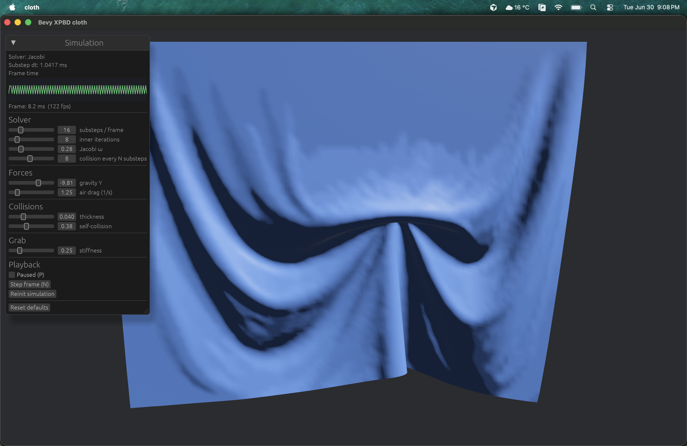

# bevy_xpbd

GPU cloth simulation for [Bevy](https://bevyengine.org/), using WebGPU compute shaders. Implements [XPBD](https://matthias-research.github.io/pages/publications/XPBD.pdf) (eXtended Position Based Dynamics; Macklin et al., 2016).



## Run the demo

```bash
cargo run --example cloth
```

The example simulates a hanging cloth sheet with mouse grab and an egui panel for solver parameters.

**Gauss–Seidel solver** (optional, instead of the default parallel Jacobi):

```bash
cargo run --example cloth --no-default-features --features solver-gauss-seidel
```

## Features

- XPBD distance constraints on the GPU (stretch, shear, bend)
- Extended PBR material that reads simulated positions from GPU buffers
- Colored Gauss–Seidel or parallel Jacobi constraint solvers
- CPU reference solver and GPU/CPU parity tests

## Docs

- [Cloth simulation stability](docs/CLOTH_SIM_STABILITY.md)
- [Metal GPU profiling (xctrace)](docs/XCTRACE_EXPORT.md)
